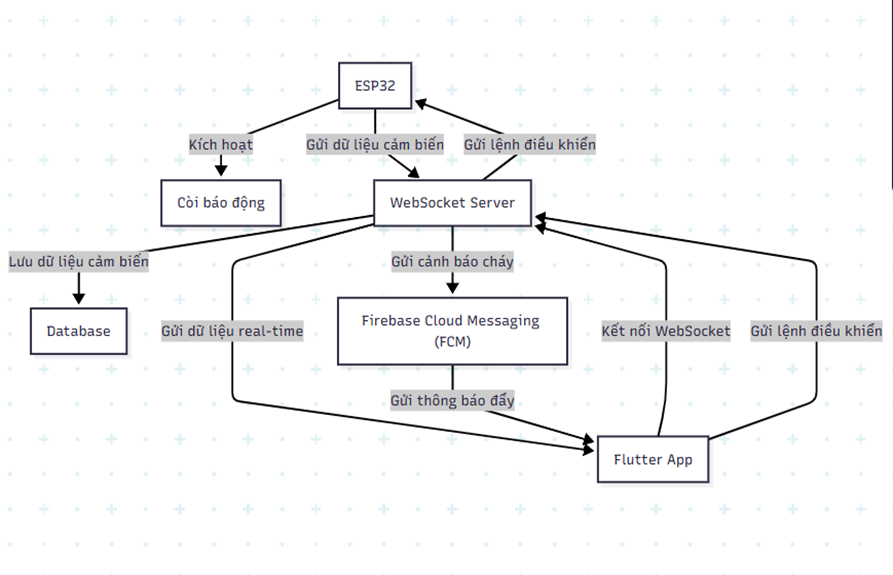

# 🔥 FIRE ALERT IoT SYSTEM
**Fire Alert IoT** is a real-time fire monitoring and alerting system built from scratch using **ESP32**, a custom **Node.js backend**, and a **Flutter mobile application**. The system detects critical fire indicators such as smoke, flame, and abnormal temperature or humidity, and immediately pushes notifications via **Firebase Cloud Messaging (FCM)** — even when the app is closed.
---
## 📌 Features
- Real-time monitoring of temperature, humidity, flame, and smoke levels.
- Immediate fire alert notifications sent to users via FCM.
- Remote control buzzer from the Flutter app.
- JWT-based user authentication and device access control.
- All communication and data processing handled Node.js server.

---

## ⚙️ System Architecture

  
## 📱 Flutter Mobile App
- Displays live sensor data (temperature, humidity, smoke).
- Controls hardware remotely (buzzer).
- Supports user login and multi-device management (via `deviceId`).
- Receives real-time updates through WebSocket.
- Push notifications powered by Firebase Cloud Messaging (even when app is terminated).

---

## 🧠 Hardware & Wiring

| Component           | ESP32 GPIO Pins     |
|---------------------|----------------------|
| DS3231 (RTC)        | SDA: 16, SCL: 17     |
| OLED                | SDA: 21, SCL: 22     |
| Buzzer              | GPIO 15              |
| Flame Sensor        | D0 → GPIO 34;A0 → GPIO 32      |
| Traffic LEDs        | Red: 27, Yellow: 26, Green: 25 |
| DHT22               | GPIO 4                |
| MQ2                  A0 → GPIO 33  D0 → GPIO 13|

ESP32 collects sensor data and communicates directly with the Node.js backend using HTTP and WebSocket.

---

## 🛠️ Technologies Used

| Layer               | Technology                            |
|---------------------|----------------------------------------|
| Microcontroller     | ESP32                                  |
| Backend API         | Node.js + Express + MongoDB            |
| Real-time Comms     | WebSocket + JWT                        |
| Mobile App          | Flutter + Riverpod + WebSocket + FCM   |
| Push Notifications  | Firebase Cloud Messaging (FCM)         |
| Auth & Security     | JWT                                    |

---

## 🧰 Installation Guide

  ### 1. ESP32 Firmware

- Developed with Arduino IDE or PlatformIO.
- Send sensor data to your backend via HTTP or WebSocket.

  ### 2. Backend (Node.js)

```bash
git clone https://github.com/DT2293/IOTAPP.git
cd server
npm install
cp .env.example .env   # Fill in MongoDB URI, JWT secret, FCM key, etc.
npm start
node server_main.js #run server

Demo and system overview are provided in the 21t1020020.pdf file located in the project root.